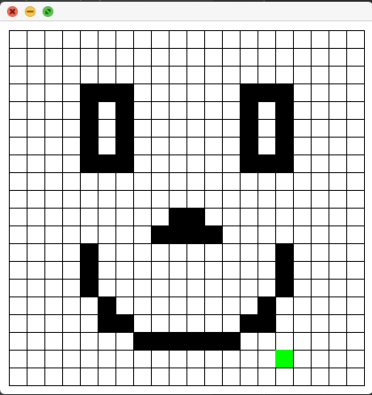

Graphical interface built with Java7 
where you're presented with a grid.
 
The user can do the following:
 
 ARROW KEYS: Move between each square
 SPACE: fill them with colour
 S: Save your current grid
 C: clear your current grid
 L: load previous grids.
 
 
This uses the library Simple Graphics from 
<Academia de Código_>.
 
 
Below is an example screenshot:
 
